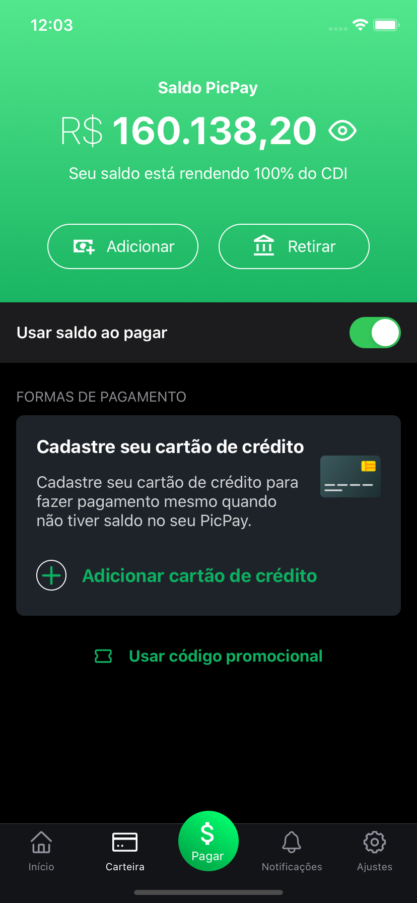

<p align="center">Banco Digital (Picpay Clone - Interface feita em ReactNative)</p>

<p align="center">
  <a href="https://github.com/ricnow/status-code/commits/master">
    
  </a>
  

  
</p>

<br>

<p align="center">
  
   
    
</p>

# 🚀 Tecnologias

Entre as tecnologias utilizadas, destaca-se:

- [Styled Components](https://styled-components.com/)
- [React Native v0.63.2](https://facebook.github.io/react-native/)
- [npm](https://www.npmjs.com/)
- [React Navigation](https://reactnavigaton.org/)
- [Expo](https://expo.io/)
- [Expo Vector Icons](https://icons.expo.fyi/)


# 💻 Installation


### Clone o repositório
```bash
$ git clone https://github.com/ricnow/banco-digital.git
```
### Entre no diretório do Repositório
```bash
$ cd banco-digital
```

### Instale as dependências
```bash
$ npm install --global expo-cli
```
```bash
$ npm install @react-navigation/native
```
```bash
$ expo install react-native-gesture-handler react-native-reanimated react-native-screens react-native-safe-area-context 
@react-native-community/masked-view
```
```bash
npm install @react-navigation/bottom-tabs
```


### Android
```bash
$ npx react-native run-android
```


## 🤔 Como contribuir

- Faça um fork desse repositório;
- Cria uma branch com a sua feature: `git checkout -b minha-feature`;
- Faça commit das suas alterações: `git commit -m 'feat: Minha nova feature'`;
- Faça push para a sua branch: `git push origin minha-feature`.

Depois que o merge da sua pull request for feito, você pode deletar a sua branch.

## :memo: Licença

Esse projeto está sob a licença MIT. Veja o arquivo [LICENSE](LICENSE.md) para mais detalhes.

---

Richelle Soares

